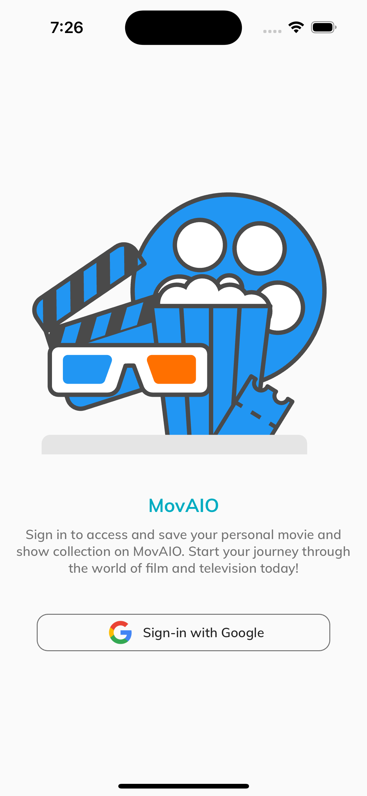
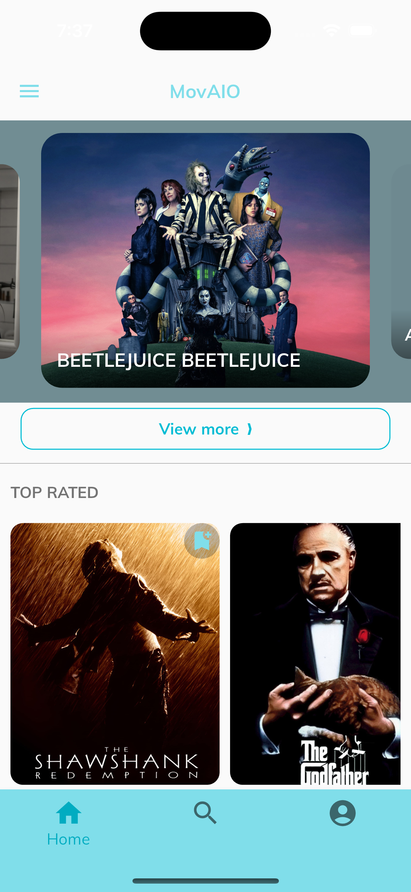
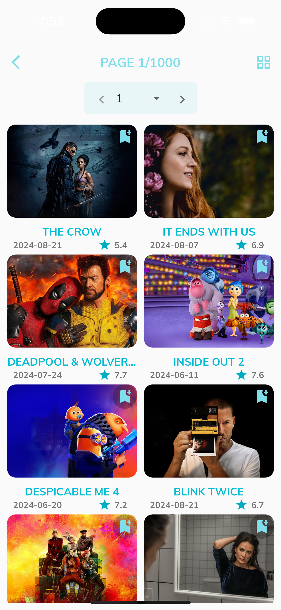
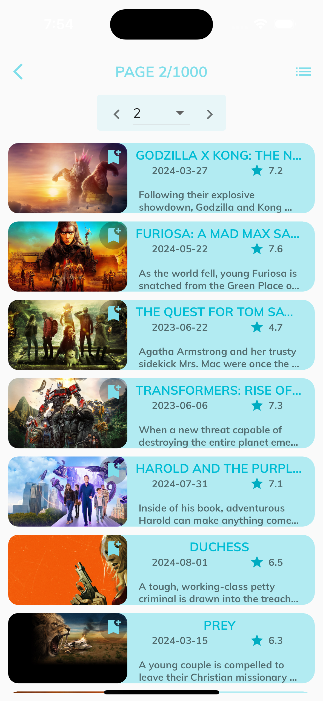
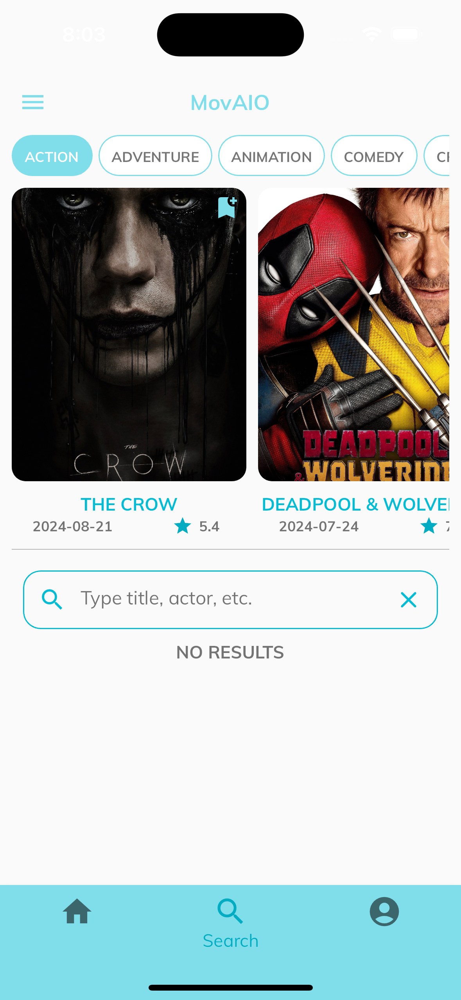
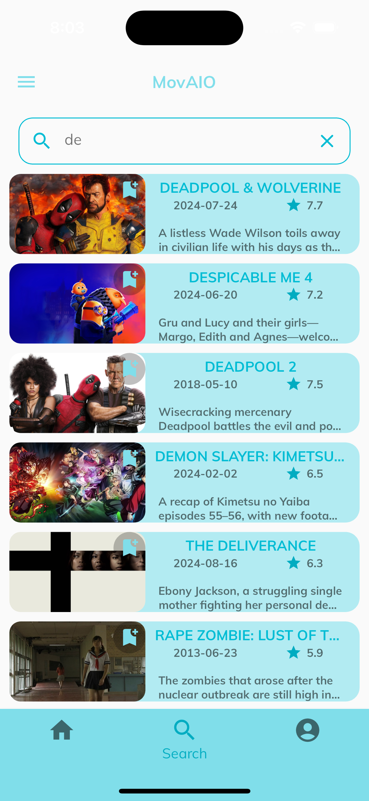
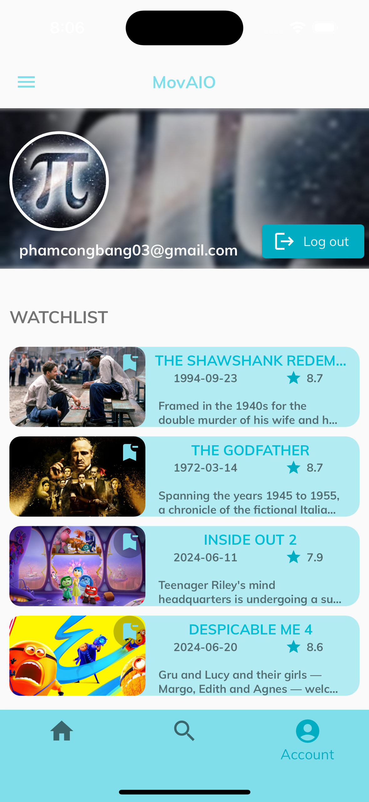

<!--Table of contents-->

  

## About the project
MovAIO is a mobile application built with Flutter that allows users to browse and search for movies, view detailed information, and explore various genres. The app leverages an API to provide real-time data on movie ratings, descriptions, and more. Its sleek user interface ensures a seamless experience for discovering movies, adding favorites, and managing watchlists. (Only applicable on iOS)

## Setup
Run the following commands from your terminal:
1) **Clone this repository**:` git clone https://github.com/ginganotnigg/MovieApp.git` 
2) **Navigate to the project directory**: `cd MovieApp`
3) **Install all the required dependencies**: `flutter pub get`
4) **Run the app**: `flutter run` (ensure you have a device/emulator running).

## Screens
### Login and Signup

    
    

- Users just need to sign-in with Google (if they had an account) to turn to main screen.
- Home screen included now-playing (carousel slider), top-rated & upcoming movies. 

### View movie detail

    

- Users can see details of a specific movie in TMDB when clicking to the movie image.
- Details included title, genres, rating, duration, overview, images and casts.
- Users can also play the movie's trailer (redirect to Youtube).

### View all movies

    
    

- User can click "View more" to get access to 20000 movies (1000 pages, each page has 20 movies).
- Movies list can be format by vertical list or grid by user choice.

### Search

    
    

- Search page can be access at Bottom Navigation Bar.
- Users can view trending movies at specific genre.
- Users type the title into search field to lookup to desired movies.

### View account

    

- Account page can be access at Bottom Navigation Bar.
- Users can log out from MovAIO in order to use another account.
- Below account's profile is movie watchlist, users can remove at this page or add favorites movie at another page to this watchlist.

## Technologies used
- We build this application by Flutter framework (an open source Framework by Google) with Dart programming language.
- Use Firebase Authentication to manage sign-in features.
- Use Cloud Firestore (a NoSQL cloud database) to store user's watchlist.
- Use TMDB API to access to multiple types of movies.
- Use BLoC to manage different state of instances (Loading, Loaded, Error).